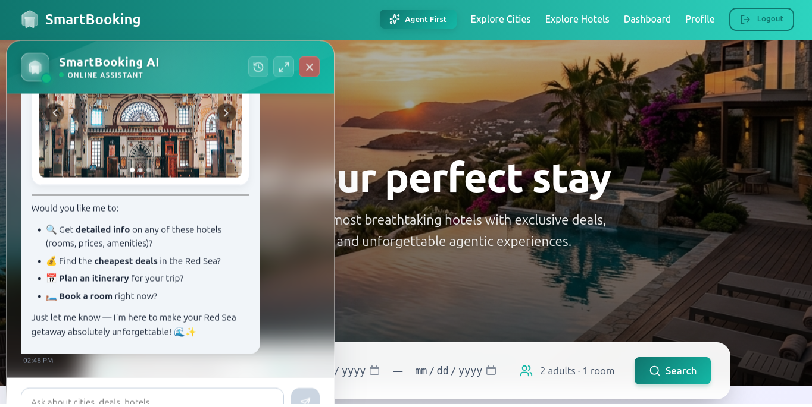
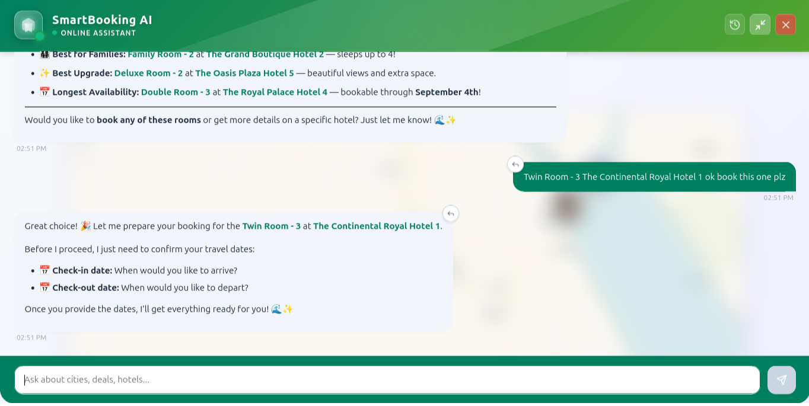

# SmartBooking Platform



A modern, enterprise-grade hotel booking and concierge platform powered by an intelligent Agentic RAG Chatbot. 

## Overview

SmartBooking (also referred to as SmartHotel) provides a seamless and high-end user experience for discovering destinations, browsing luxury hotels, and booking rooms. The platform integrates a real-time AI assistant that helps users plan itineraries, locate properties on a map, and explore hotel amenities through an interactive interface.

## Architecture

The project is structured into two main components:

- **Frontend (`/frontend`)**: A high-performance React application built with Vite. It features a modern, responsive UI utilizing CSS variables, glassmorphism, and cinematic layout designs. 
- **Backend (`/backend`)**: A robust Django application powered by Django REST Framework (DRF). It handles user authentication, data management (Cities, Hotels, Rooms), and serves the intelligent Agentic RAG capabilities.

## Key Features

- **Interactive UI/UX**: Premium design aesthetics using CSS variables and modern layout patterns.
- **AI Concierge**: An embedded AI chatbot built with markdown support and draggable custom UI widgets (Maps, Itineraries, Carousels).
- **Destination Discovery**: A visual-first approach to exploring cities and filtering available accommodations.
- **Secure Authentication**: Token-based authentication securing user profiles, administrative dashboards, and AI interactions.

## Screenshots

<div align="center">
  
  
</div>
<br />
<div align="center">
  
</div>

## Getting Started

### Prerequisites

Ensure you have the following installed:
- Node.js (v16 or higher)
- Python (3.10 or higher)
- Redis (for backend caching and asynchronous tasks)

### Running the Application

A development script is provided to streamline the startup process.

1. Clone the repository and navigate to the project root.
2. Execute the development script:
   ```bash
   bash dev.sh
   ```
3. The application will be accessible at `http://localhost:5173`.

### Manual Setup

If you prefer to run the components separately:

**Backend Setup**
```bash
cd backend
python -m venv venv
source venv/bin/activate
pip install -r requirements.txt
python manage.py migrate
python manage.py runserver
```

**Frontend Setup**
```bash
cd frontend
npm install
npm run dev
```

## Technologies Used

- **Frontend**: React, Vite, React Router DOM, Lucide React, React Markdown.
- **Backend**: Django, Django REST Framework, PostgreSQL (or SQLite for development), Redis.
- **AI & RAG**: Python-based Agentic reasoning modules.

## License

This project is licensed under the MIT License. See the `LICENSE` file for more details.
